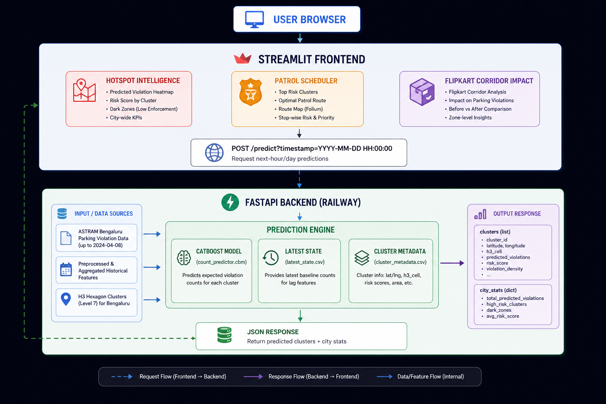

# 🚦 ParkSense — Predictive Parking Enforcement Intelligence

> **Gridlock Hackathon 2.0 | Flipkart | PS1: Parking-Induced Congestion**

ParkSense is an AI-powered enforcement command center that transforms raw parking violation data into **predictive, actionable intelligence**. It identifies hidden "Dark Zones" (49% of violations with no junction mapping), predicts hourly violation spikes using a CatBoost model with lag features, and generates optimal patrol routes for targeted enforcement.

[](https://parksense-pvyrecjmv88qdzh7envuxq.streamlit.app/)
[](https://web-production-25afb.up.railway.app)
[]()

---

## 📌 Table of Contents

- [Overview](#-overview)
- [Key Features](#-key-features)
- [How It Works](#-how-it-works)
- [Tech Stack](#-tech-stack)
- [Architecture](#-architecture)
- [Installation & Setup](#-installation--setup)
- [API Integration](#-api-integration)
- [Deployment](#-deployment)
- [Future Enhancements](#-future-enhancements)
- [Screenshots](#-screenshots)
- [Team](#-team)
- [License](#-license)

---

## 🎯 Overview

**The Problem:** On-street illegal parking chokes Bengaluru's roads, but enforcement is reactive and patrol-based. Traffic police have no heatmap of violations, no understanding of temporal patterns, and no way to prioritize enforcement zones.

**Our Solution:** ParkSense uses a CatBoost model trained on 298K+ ASTraM violation records to predict hourly violation risks. It recovers 147,880 "No Junction" records using H3 hexagonal indexing, and generates dynamic patrol rosters that tell police exactly **where**, **when**, and **how** to deploy.

**The Flipkart Angle:** By protecting the 10 AM–2 PM delivery window, ParkSense reduces delivery delays and improves fleet efficiency — directly impacting Flipkart's bottom line.

---

## ✨ Key Features

### 1. 🗺️ Hotspot Intelligence
- **Dual-layer map:** Named junctions (yellow circles) vs. Dark Zones (purple hexagons)
- **Heatmap overlay** for violation density visualization
- **Temporal fingerprinting:** Each zone shows its unique hourly violation pattern
- **Impact Score:** Weighted ranking combining violation count, severity, and repeat-offender density

### 2. 👮 AI-Generated Patrol Scheduler
- **Risk-based routing:** Sorts zones by API's `risk_score` and computes greedy nearest-neighbor patrol route
- **Dynamic roster:** Assigns patrol cars to stops with turn-by-turn Google Maps navigation links
- **What-if projection:** Shows coverage gain if you add one more patrol car

### 3. 🚚 Flipkart Delivery Corridor
- **Pre-clearance alerts:** Identifies zones that need enforcement before the 10 AM delivery window
- **Cost savings calculator:** Slider-based ROI estimation for Flipkart operations

### 4. 🧠 Model Explainability
- **Feature importance chart** from the CatBoost model (fetched via API)
- **Repeat offender watchlist:** Top serial violators with their favorite zones and hours

---

## ⚙️ How It Works

### Prediction Engine (Backend)

The backend CatBoost model uses **lag features** to predict violations:

| Feature Type | Examples |
| :--- | :--- |
| **Time Features** | `hour`, `weekday`, `month`, `hour_sin`, `hour_cos` |
| **Lag Features** | `lag_1`, `lag_2`, `lag_24`, `lag_48`, `lag_168`, `lag_336` |
| **Rolling Means** | `rolling_mean_3`, `rolling_mean_6`, `rolling_mean_24`, `rolling_mean_72` |
| **Historical Averages** | `avg_hour_count`, `avg_hour_weekday_count` |

**Prediction Date:** April 9, 2024 — the immediate next day after the training set (April 8, 2024). The lag features are derived from the `latest_state.csv` baseline, making this the only date with accurate predictions. *In production, we would retrain daily to roll predictions forward.*

### Frontend Visualization (Streamlit)

1. User selects an **hour** and clicks **Fetch Predictions**.
2. App sends `POST /predict` with `{"timestamp": "2024-04-09 HH:00:00"}`.
3. Backend returns cluster predictions with `risk_score`, `total_predicted_violations`, and metadata.
4. App renders interactive map, patrol route, and business insights instantly.

---

## 🧰 Tech Stack

| Component | Technology |
| :--- | :--- |
| **Frontend** | Streamlit (Python) |
| **Mapping** | Folium + OpenStreetMap |
| **Charts** | Plotly |
| **Backend** | FastAPI (Python) |
| **ML Model** | CatBoost Regressor |
| **Spatial Indexing** | H3 (Uber) |
| **Deployment (Frontend)** | Streamlit Cloud |
| **Deployment (Backend)** | Railway |

---

## 🏗️ Architecture



---

## 🚀 Installation & Setup

### Prerequisites

- Python 3.10+
- Git
- (Optional) Railway account for backend

### Local Development

```bash
# 1. Clone the repository
git clone https://github.com/sonalikachandra/ParkSense.git
cd ParkSense

# 2. Create virtual environment
python -m venv venv
source venv/bin/activate  # On Windows: venv\Scripts\activate

# 3. Install dependencies
pip install -r requirements.txt

# 4. Run the app
streamlit run app.py

```
## 🔌 API Integration

ParkSense communicates with the backend via three endpoints:

- **`/predict` (POST)** → Sends timestamp, returns cluster predictions with risk scores
- **`/feature_importance` (GET)** → Returns CatBoost feature importance values
- **`/repeat_offenders` (GET)** → Returns top repeat offenders with violation counts

---

## 🔮 Future Enhancements

- Daily retraining with fresh data to roll predictions forward
- Real-time CCTV feed integration for live violation detection
- Mobile app for traffic police to receive patrol assignments
- Historical trending and seasonal pattern analysis
- WhatsApp alerts for enforcement teams

---

## 📸 Screenshots

### Hotspot Intelligence Map
*Named junctions (yellow) and Dark Zones (purple) with interactive popups.*

### Patrol Scheduler
*AI-generated patrol route with turn-by-turn Google Maps navigation.*

### Flipkart Delivery Corridor
*Pre-clearance alerts and cost savings calculator.*

---

## 👥 Team

- **1.** *Sonalika Chandra*
- **2.** *Satyam Raj*

---

## 📄 License

Built for **Gridlock Hackathon 2.0** by Flipkart. All rights reserved.

---

## 🙏 Acknowledgments

- Bengaluru Traffic Police (ASTraM) for the dataset
- Flipkart for hosting the hackathon
- CatBoost and Uber H3

---

<div align="center">
  <sub>Built with ❤️ for the Gridlock Hackathon 2.0</sub>
</div>